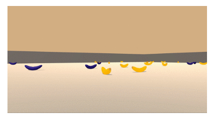
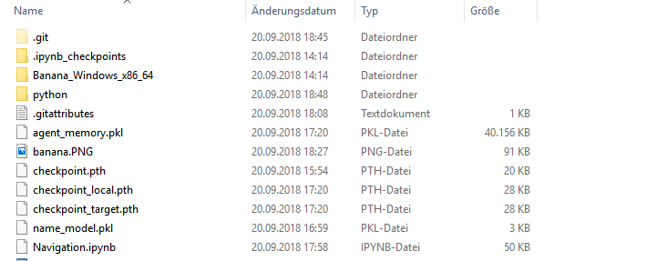
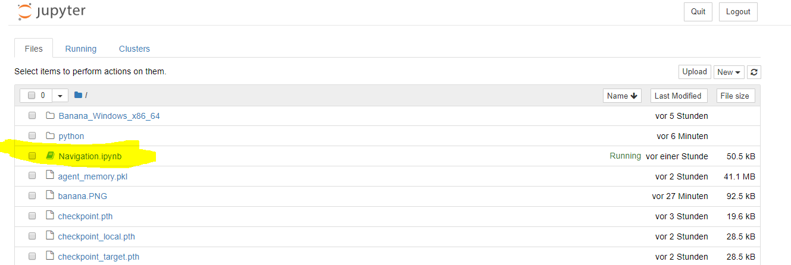

# Project Navigation

## Project Details
This project demonstrates the usage of a deep reinforcement algorithm to navigate in a large, square world presented by [Unity's ML Agent environment](https://unity3d.com/de/machine-learning). During the agent's journey, it has to collect yellow bananas to earn a reward of +1 and avoid collection rewards of -1 by collection blue bananas. 



The actions of the agent (action space) are four discrete moves:

* 0 - move forward.
* 1 - move backward.
* 2 - turn left.
* 3 - turn right.

The state space has 37 dimensions and contains the agent's velocity, along with ray-based perception of objects around the agent's forward direction. 

The task is episodic, and in order to solve the environment, the agent must get an average score of +13 over 100 consecutive episodes. 


## Getting Started

The following steps are tested on Windows 10, 64-bit. For other installation instructions please refer to [Udacity's instructions](https://github.com/udacity/deep-reinforcement-learning#dependencies)

First, download this repositoy

```
git clone https://github.com/trobar/navigation.git
cd navigation
```

Second, setup your conda environment.

```
conda create -n drlnav python=3.6
activate drlnav
```

Third, install [PyTorch](https://pytorch.org/get-started/locally/). Install PyTorch before installing the Udacity dependencies on Unity's ML agents, because on some Windows versions a dependency conflict exists.  


```
conda install pytorch -c pytorch
pip3 install torchvision
```

Fourth, install the Unity's ML agents as part of Udacity's dependency package. Navigate to the python subdir, install it and navigate back/one level up:

```
cd python
pip install .
cd ..
```

Fifth, install [dill](https://pypi.org/project/dill/) to automatically serialize data-structures.

```
pip install dill
```

Sixth, download the environment from one of the links below.  You need only select the environment that matches your operating system:
* Linux: [click here](https://s3-us-west-1.amazonaws.com/udacity-drlnd/P1/Banana/Banana_Linux.zip)
* Mac OSX: [click here](https://s3-us-west-1.amazonaws.com/udacity-drlnd/P1/Banana/Banana.app.zip)
* Windows (32-bit): [click here](https://s3-us-west-1.amazonaws.com/udacity-drlnd/P1/Banana/Banana_Windows_x86.zip)
* Windows (64-bit): [click here](https://s3-us-west-1.amazonaws.com/udacity-drlnd/P1/Banana/Banana_Windows_x86_64.zip)

Extract the respective file in the current directory. 

After all these tasks your directory should somehow look like this:




## Instructed

You start the agent by running Jupyter Notebook 

```
jupyter notebook
```

and open Navigation.ipynb:

